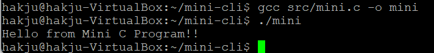
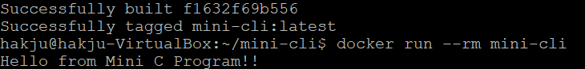
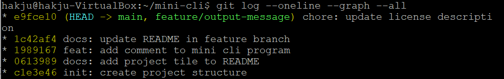

# 🛠️ Mini CLI Tool Project

> 본 프로젝트는 간단한 C 언어 기반 CLI 프로그램을 제작하고
Linux 환경에서 실행한 뒤 Docker 이미지로 패키징하여
GitHub를 통해 배포하는 실습 프로젝트입니다.
이를 통해 오픈소스 개발의 기본 흐름을 경험하는 것을 목표로 합니다.

---

## 📁 프로젝트 구조

```
mini-cli/
 ├─ src/
 │   └─ mini.c
 ├─ Dockerfile
 ├─ README.md
 ├─ LICENSE
 └─ docs/
     └─ images/
         ├─ linux-run.png
         ├─ docker-run.png
         └─ git-log.png
```

---

## 🚀 1. Mini 프로그램


### ✔ 코드

```c
#include <stdio.h>

int main() {
  printf("Hello from Mini C Program!!!\n");
  return 0;
}
```

---

## 🧪 2. Linux 실행 결과

> Ubuntu Linux 환경에서 gcc 컴파일러를 설치하고 프로그램을 컴파일 및 실행하였다.

### ✔ 실행 명령어
```bash
# 프로그램 소스 코드
gcc src/mini.c -o mini
./mini
```

### 실행 화면 캡처  
(예: `docs/images/linux-run.png`)


---

## 3. Dockerfile 및 실행 결과

### ✔ Dockerfile
```Dockerfile
FROM ubuntu:24.04

WORKDIR /app

COPY src/mini.c .

RUN apt update && \
    apt install -y gcc && \
    gcc mini.c -o mini

CMD ["./mini"]
```
> Ubuntu 기반 이미지에서 gcc를 설치하고 C 프로그램을 컴파일하여 실행하도록 구성하였다.

### ✔ Docker 이미지 빌드
```bash
docker build -t mini-cli .
```

### ✔ Docker 실행
```bash
docker run --rm mini-cli
```

### ✔ 실행 화면 캡처  
(예: `docs/images/docker-run.png`)


---

## 4. GitHub 버전관리 내역

### 체크리스트
- [✔] Commit 5회 이상  
- [✔] Branch 생성  
- [✔] Branch → main Merge  
- [✔] 의미 있는 Commit 메시지  

### 설명
```
feature/output-message 브랜치를 생성하여
CLI 프로그램의 출력 메시지 및 README 문서를 수정한 뒤
main 브랜치로 merge하였다.
```

### 캡처
(예: `docs/images/git-log.png`)


---

## 5. LICENSE 파일  
선택한 라이선스: MIT

```
본 프로젝트는 MIT License를 적용합니다.
```

---

## 6. 고찰

- 배운 점:  Linux 환경에서 프로그램을 컴파일하고 Docker로 패키징하는 전체 과정을 경험할 수 있었습니다.
또한 Git을 이용한 브랜치 생성, 커밋, 머지 과정에 대한 이해가 깊어졌습니다. 교수님 감사합니다.
- 어려웠던 점:  서버 간 파일 전송 과정과 Docker 이미지 빌드 과정에서 오류를 해결하는 부분이 어려웠습니다.
- 흥미로웠던 부분:  작성한 프로그램이 Docker 컨테이너 안에서 동일하게 실행되는 점이 인상 깊었습니다.
- 개선하고 싶은 점:  향후에는 입력값을 받아 처리하는 CLI 프로그램이나 스크립트 기반 도구로 확장해보고 싶습니다.

---

## 7. 참고 자료

- https://docs.docker.com/  
- https://gcc.gnu.org/  
- https://choosealicense.com/  
